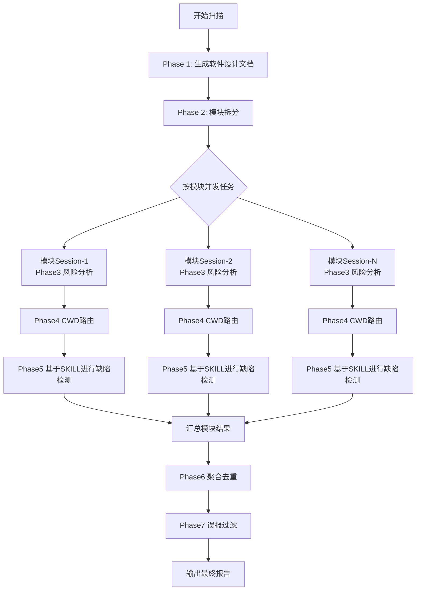

# 当前项目工作流程设计文档

## 1. 目的

本文档说明当前项目的安全审计能力与阶段化执行流程，重点描述缺陷检测如何结合 `skill` 调用完成分析与结果审计。

## 2. 能力概述

项目采用“全仓理解 + 模块化并发检测 + 聚合过滤”流程：

- 先生成全仓软件设计文档（中文 Markdown），形成后续分析上下文。
- 再进行模块拆分，明确模块边界和关键路径。
- 对每个模块并发执行 3/4/5 阶段（同一模块在同一 session 串行）。
- 汇总去重后执行误报过滤，输出最终缺陷报告。

## 3. 阶段流程

1. `Phase 1`：软件设计文档生成（全仓）
2. `Phase 2`：模块拆分（基于 Phase 1 文档）
3. `Phase 3`：模块业务与风险分析
4. `Phase 4`：模块 CWD 路由规划
5. `Phase 5`：模块缺陷检测（基于 skill）
6. `Phase 6`：缺陷聚合与去重
7. `Phase 7`：误报过滤与最终输出

## 4. 核心执行机制

### 4.1 模块级并发模型

- 系统按模块创建并发任务。
- 每个模块创建一个独立 OpenCode session。
- 在该模块 session 内串行执行 `Phase 3 -> Phase 4 -> Phase 5`。
- 支持部分成功汇总：部分模块失败不会阻断全部结果；仅当全部模块失败时阶段失败。

### 4.2 Phase 5 缺陷检测与 Skill 机制

缺陷检测并非只基于模型文本推断，而是结合 CWD 路由和 skill 使用证据：

1. `Phase 4` 先给出模块级 CWD 优先级（`cwd_id`, `skill_name`, `priority_score`）。
2. `Phase 5` 依据选择的CWD调用对应的SKILL，对模块代码进行针对性检测，输出缺陷明细（文件、行号、缺陷类型、可利用路径、修复建议等）。
3. 在模块 session 内，系统会拉取会话消息历史（`session.messages`）并审计 `tool=skill` 的调用轨迹。
4. 审计结果会回写到缺陷字段 `skill_load_status`，用于标注“是否有可验证 skill 调用证据”。

当前 `skill_load_status` 的审计语义：

- `loaded_verified`：检测到对应 skill 调用且状态完成。
- `failed_verified`：检测到对应 skill 被尝试调用，但未完成/失败。
- `unknown_unmatched_trace`：检测到 skill 工具调用轨迹，但与该缺陷 `skill_name` 未匹配。
- `unknown_no_trace`：未检测到任何 skill 工具调用轨迹。

说明：若未检测到 skill 调用轨迹，系统仅记录审计状态，不会直接判定模块失败。

## 5. 关键产物

- Phase 1
  - `phase1_architecture_document.md`
  - `phase1_architecture_result.json`
- Phase 2
  - `phase2_result.json`
- Phase 3/4/5（模块级）
  - `phase3_module_<idx>_*.json/.txt`
  - `phase4_module_<idx>_*.json/.txt`
  - `phase5_module_<idx>_*.json/.txt`
  - `phase5_module_<idx>_session_messages.json`
  - `phase5_module_<idx>_skill_audit.json`
- 汇总
  - `phase3_result.json`
  - `phase4_result.json`
  - `phase5_result.json`
  - `phase6_result.json`
  - `phase7_result.json`
  - `final_result.json`

## 6. 可观测性与稳定性

- 每个阶段都会输出统一 metadata（耗时、状态、输入输出文件）。
- JSON 解析失败不再静默回退为空结果，避免“无结果被误判为无漏洞”。
- `Phase 5` 汇总中包含 skill 审计统计（如有无 trace 的模块数、可验证 skill 缺陷数）。

## 7. 维护建议

- 调整提示词后，优先检查 `phase5_module_*_skill_audit.json` 与 `skill_load_status` 分布。
- 若 `unknown_no_trace` 占比异常高，优先排查模型工具调用可见性和服务端事件输出。
- 过滤策略应与目标漏洞类型保持一致，避免将核心缺陷类型系统性过滤。

## 8. 流程图

## 9. 初步实现总结

面向全仓代码的分阶段安全审计体系：  
从代码理解、风险识别、缺陷检测到误报过滤和结果落盘，形成可重复、可追溯、可持续演进的工程化闭环，建设一条可长期运行的“安全分析生产线”。

在技术实现上，项目已形成较清晰的任务分层与流程编排。
整体流程首先通过全仓级上下文构建和模块划分建立分析基础，在此之上按阶段推进架构理解、模块风险分析、漏洞检测、聚合去重和误报过滤，并采用“模块间并发、模块内串行”的执行模型，在保证分析吞吐的同时维持单模块推理链路的完整性与可追溯性。底层通过统一会话管理承载 OpenCode 模型调用，输出侧通过统一产物管理沉淀各阶段结果、元数据和中间产物，确保整个分析过程可观测、可审计、可回放。

在此基础上，项目引入了 skill 调用机制，作为代码审计能力的重要组成部分。
对于特定CWD漏洞类型，不只依赖通用模型进行文本推断，而是先结合模块风险分析结果与漏洞类别路由信息，选择对应的 skill，在模块级会话中调用专用能力进行针对性检测，是将“通用大模型理解能力”与“特定漏洞专项审计能力”结合起来，提高分析深度、降低泛化误判，并增强结果的可解释性。与此同时，系统会对会话消息中的 tool 调用轨迹进行审计，记录 skill 是否被实际加载、是否调用完成、调用结果是否与当前缺陷类型匹配，并将这些证据回写到检测结果中，用于支撑后续结果校验与质量评估。

具体任务可以概括为四层：
- 第一层：全局理解与上下文构建  
  对仓库先做整体结构理解，形成架构视图和模块视角，避免后续检测只看局部代码片段导致误判。目标是让模型、规则以及后续 skill 调用都建立在“有上下文”的前提下工作，而不是脱离全局进行盲扫。
- 第二层：分阶段、模块化审计执行  
  将流程拆成可独立验证的阶段，如架构理解、模块拆分、风险分析、漏洞检测、去重聚合、误报过滤等，并支持按模块并发、模块内串行执行。这样既能保证整体吞吐能力，也能保证每个模块分析链路完整、上下文连续、结果可追溯。
- 第三层：专项能力增强与 skill 驱动审计  
  在模块化审计过程中，针对特定漏洞类型引入对应 skill 进行专项检测，使代码审计不再仅依赖通用提示词，而是具备“按漏洞类别路由到专门能力”的执行机制。系统同时对 skill 调用行为进行审计和记录，包括是否实际触发、是否成功完成、是否与目标漏洞类型匹配，从而为最终缺陷结果提供更强的技术依据和过程证据。
- 第四层：结果治理、误报控制与工程化运维能力建设  
  对原始缺陷做结构化聚合、去重和过滤，降低低信号告警比例，提升最终结果可用性。与此同时，统一配置管理、统一会话与运行时管理、统一产物落盘与元数据记录，确保整个流程可复现、可调优、可定位问题，让系统从“能跑一次”升级为“可长期维护、可持续演进”。
